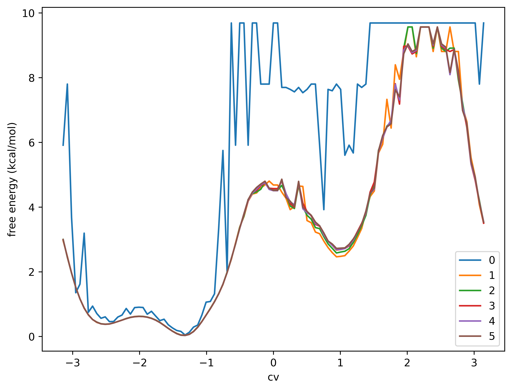
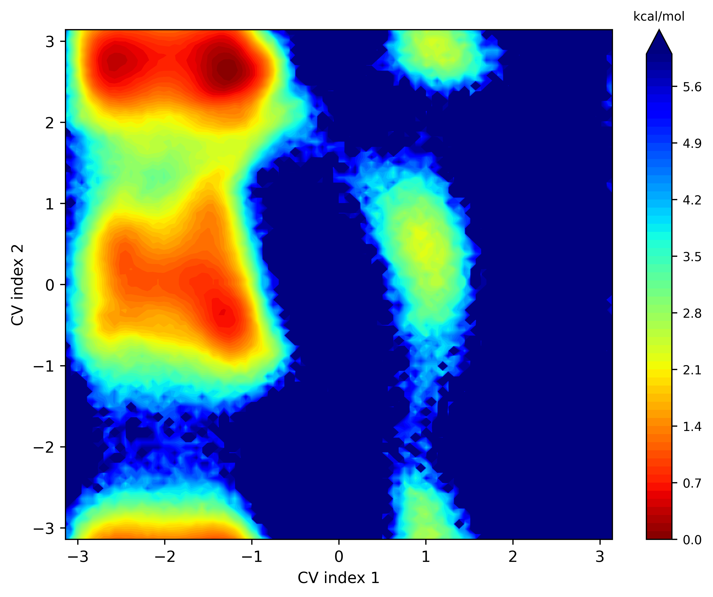

# Table of contents
- [About Rid-kit](#about-rid-kit)
- [Quick Start](#quick-start)
- [Run the workflow without k8s enviroment](#run-the-workflow-without-k8s-environment)
- [Main procedure of RiD](#main-procedure-of-rid)
- [Use Rid-kit](#use-rid-kit)
- [Installation of enviroment](#installation-of-enviroment)
- [Installation of DeepMD potential](#installation-of-dp)
- [Configure simulations](#configure-simulations)
- [Configure machine resources](#configure-machine-resources)
- [Configure MCMC dimension reduction](#configure-mcmc)
- [Troubleshooting](#troubleshooting)

# About Rid-kit
Rid-kit is a package written in Python, designed to do enhanced sampling using reinforced dynamics. It aims to learn the free energy surface on the fly during MD run, and uses it as the bias potential during the next MD run. Its advantage is the ability to use a large number of CVs (100), thus can be used to simulate conformational changes of big molecules such as in the problem of protein folding.

For more information, check the [documentation](https://rid-kit-dflow.readthedocs.io/en/latest/).

# Quick start
Rid-kit is based on [dflow](https://github.com/deepmodeling/dflow), one can decide whether to use a k8s environment to run a workflow. It is recommended to use k8s enviroment to run the workflow unless it is not doable anyway. The dflow team provide a community version of k8s [deepmodeling k8s](https://workflows.deepmodeling.com/), making the use of Rid-kit very convenient. To use the community version of k8s, one first need to register a Bohrium account in [Bohrium](https://bohrium.dp.tech/login) and learn a few concepts (job, jobgroup, project id) in the Bohrium website documents. Then the use of rid-kit is very easy.

## Set the enviroment variables
Just set the enviroment variables based on your personal Bohrium account information by

```
export DFLOW_HOST=https://workflows.deepmodeling.com
export DFLOW_K8S_API_SERVER=https://workflows.deepmodeling.com
export DFLOW_S3_REPO_KEY=oss-bohrium
export DFLOW_S3_STORAGE_CLIENT=dflow.plugins.bohrium.TiefblueClient
export BOHRIUM_USERNAME="<bohrium-email>"
export BOHRIUM_PASSWORD="<bohrium-password>"
export BOHRIUM_PROJECT_ID="<bohrium-project-id>"
```

## Install Rid-kit
Install the latest rid-kit

```bash
git clone git@github.com:PKUfjh/rid-kit.git
cd rid-kit
git checkout dflow
pip install setuptools_scm
pip install .
```

## Run an example
Change to the rid-kit directory

```bash
cd rid-kit
```

Run a example of Ala-dipeptide using dihedral as CVs (change to your own Bohrium account information)

```bash
rid submit -i ./tests/data/000 -c ./rid/template/rid_gmx_dih.json -m ./rid/template/machine_bohrium_k8s.json
```

You can also run the example on a Slurm machine (But you need to configure a conda enviroment on the slurm, see below)

```bash
rid submit -i ./tests/data/000 -c ./rid/template/rid_gmx_dih.json -m ./rid/template/machine_slurm_k8s.json
```

You can also run the example using distance as CVs (This will use constrained md as the mean force calculator)

```bash
rid submit -i ./tests/data/000 -c ./rid/template/rid_gmx_dis.json -m ./rid/template/machine_bohrium_k8s.json
```

You can specify the workflow name by providing WORKFLOW_ID after "-d", for example:

```bash
rid submit -i ./tests/data/000 -c ./rid/template/rid_gmx_dih.json -m ./rid/template/machine_bohrium_k8s.json -d ala-dipeptide-1
```

**Note that the defined workflow-id should only contain lower case alphanumeric character, and specifal character "-".**

Note that if you want to use constrained MD as the mean force calculator, apart from setting `method` to be `constrained` in the `label_config`, you should add `[ constraints ]` line corresponding to the `[ moleculartype ]` in your input `topology` file yourself, since gromacs specifies constraints information for each `[ moleculartype ]`.

Also note that, since gromacs only supports constrained MD for `distance CV`, the constrained MD simulation in rid-kit only supports `distance CV` at this moment.

## Continue from an old workflow

Using `resubmit` to continue from an old workflow

```bash
# suppose the original workflow id is OLD_ID
rid resubmit -i ./tests/data/000 -c ./rid/template/rid_gmx_dis.json -m ./rid/template/machine_bohrium_k8s.json OLD_ID -d NEW_ID 
```

If you want to resubmit from a particular `iteration` and `step`:

```bash
rid resubmit -i your_dir -c path_to_rid.json -m path_to_machine.json OLD_ID -t ITERATION-ID -p STEP-KEY -d NEW_ID
```

 The `ITERATION-ID` is just `n`th iteration the workflow has been executed. The `STEP-KEY` in rid includes the following steps: `prep-exploration`, `run-exploration`, `prep-select`, `run-select`, `prep-label`, `run-label`, `collect`, `merge`, `train`, `model-devi`.

## Download files from the workflow

```bash
rid download WORKFLOW_ID -p STEP-KEY -f FILE_NAME -a ITERATION_START -e ITERATION_END -o OUTPUT_DIR
```

typically we want the trajectories information from each exploration step, suppose we run a workflow for 20 iterations.

```bash
rid download WORKFLOW_ID -p run-exploration -f trajectory -a 1 -e 20 -o my_protein_out
```

`ITERATION_START`(default 1) specifies from which iteration to start download, `ITERATION_END`(default 100) specifies to which iteration to end download. `OUTPUT_DIR`(default "./") is the output directories of the download.

The `STEP-KEY` in rid includes the following steps: `prep-exploration`, `run-exploration`, `prep-select`, `run-select`, `prep-label`, `run-label`, `collect`, `merge`, `train`, `model-devi`.

The `FILE_NAME` in `prep-exploration` includes `task_path`.

The `FILE_NAME` in `run-exploration` includes `trajectory`, `conf_out`,`plm_out`,`md_log`,`bias_fig`, `model_devi_fig`, `dp_model_devi_fig`, `dp_model_devi`, `dp_selected_indices`, `dp_selected_confs`, `projected_fig`.

The `FILE_NAME` in `prep-select` includes `cluster_fig`, `cluster_selection_index`, `cluster_selection_data`.

The `FILE_NAME` in `run-select` includes `selected_confs`, `selected_cv_init`, `model_devi`, `selected_indices`,`selected_conf_tags`.

The `FILE_NAME` in `prep-label` includes `task_path`.

The `FILE_NAME` in `run-label` includes `plm_out`, `cv_forces`, `mf_info`, `mf_fig`,`md_log`.

The `FILE_NAME` in `collect` includes `data_new`.

The `FILE_NAME` in `merge` includes `data_raw`.

The `FILE_NAME` in `train` includes `model`, `train_log`, `train_fig`.

The `FILE_NAME` in `model_devi` includes `model_devi`, `model_devi_png`.

## Reduce the dimension of free energy model
After the Rid-kit Run, the workflow will generate several numbers of free energy models (.pb). The Rid-kit currently support MCMC to reduce the dimension of the free energy model, for example:
```bash
rid redim -i ./test/data/models -c ./rid/template/rid_mcmc_cv_dih.json -m ./rid/template/machine_bohrium_k8s_mcmc.json
```
Then you will get the projected free energy surface for ala-dipeptide
 | 
---|---

# Run the Workflow without k8s environment`
To run the workflow without k8s environment, one can use the `Debug` mode of `Dflow`. In this mode however, one can not monitor the workflow in the `Argo` UI.
## Run an example
If one wants to run the workflow on the `Slurm` machine locally, change to the rid-kit directory and type (change to your slurm configuration)

```bash
DFLOW_DEBUG=1 rid submit -i ./tests/data/000 -c ./rid/template/rid_gmx_dih.json -m ./rid/template/machine_slurm_local.json -d ala-dipeptide-1
```

# Main procedure of RiD

RiD will run in iterations. Every iteration contains tasks below:

1. Biased MD;
2. Restrained/Constrained MD;
3. Training neural network.

## Biased MD

Just like Metadynamics, RiD will sample based on a bias potential given by NN models. An uncertainty indicator will direct the process of adding bias potential.

## Restrained/Constrained MD

This procedure will calculate the mean force based on the sampling results of restrained MD or constrained MD, which can generate data set for training. 

## Neural network training

A fully connected NN will be trained via sampling data. This network will generate a map from selected CV to free energy.

A more detailed description of RiD is published now, please see:

> [1]  Zhang, L., Wang, H., E, W.. Reinforced dynamics for enhanced sampling in large atomic and molecular systems[J]. The Journal of chemical physics, 2018, 148(12): 124113.
>  
> [2]  Wang, D., Wang, Y., Chang, J., Zhang, L., & Wang, H. (2022). Efficient sampling of high-dimensional free energy landscapes using adaptive reinforced dynamics. Nature Computational Science, 2(1), 20-29.

# Use Rid-kit

A tutorial on using Rid-kit can be found as follows:

- [Tutorial](/docs/source/tutorial.ipynb)

# Enviroment settings

Installation of the computation enviroment can be found in
- [Installation](docs/source/install.md)

# Installation-of-dp
Installation of the DeepMD potential support can be found in
- [Installation of dp](docs/source/install_dp.md)
  
# Configure simulations
- [configure simulations](docs/source/rid_configuration.md)

# Configure machine resources
- [configure machines](docs/source/rid_machine.md)

# Configure mcmc 
- [configure mcmc dimension reduction](docs/source/mcmc_configuration.md)

# Workflow Synopsis

- 

# Troubleshooting
- [Installation](docs/source/troubleshooting/installation.md)
- [Minikube](docs/source/troubleshooting/minikube.md)
- [Submit](docs/source/troubleshooting/submit.md)
